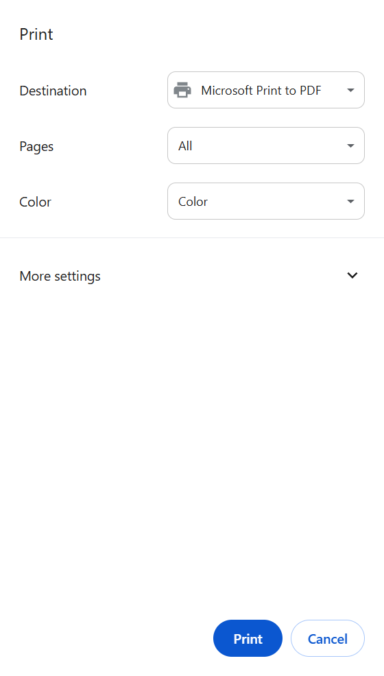

# Print a document

To print a document, do the following:

{ align=right : style="height:476px;width:271px"} 

1. Open the document in Google Docs.
1. Click **File** > **Print**.
1. In the **Print** dialog, select required print settings:
    - From **Destination** list, select a printer.
    - From **Pages** list, select required pages.
    - From **Color** list, select print color.
1. Optional: For advanced print settings, click **More settings** .
1. Click **Print**.

Document is printed.

!!! info
    Use **Microsoft print to PDF** to create a PDF file from your document.