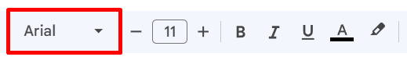
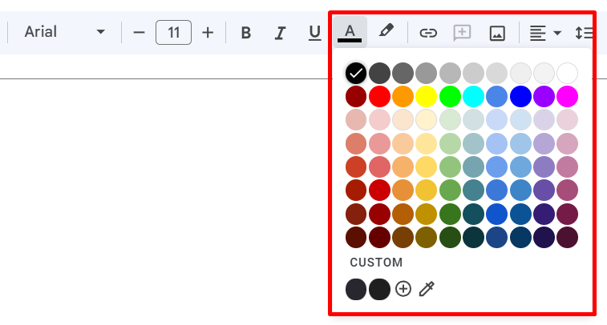
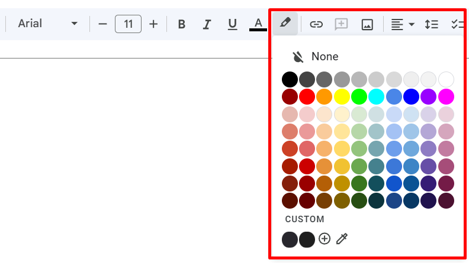

# Format a text
In Google Docs, text can be formated using menu icons or **Format** tab.

Prerequisites:

- Open a document in Google Docs and select the text.

## Format with icons

To format a text, do the following:

1. To change a font, select the font from the **Font** list.

    { style="height:50%;width:50%"}

1. To change font size, select font size from the **Font size** list or enter required font size manually.
    - Optional: Click :material-minus: **Decrease font size** or :material-plus: **Increase font size** to gradually change font size.

    { style="height:50%;width:50%"}

1. To change font style, click **Bold**, **Italic**, or **Underline**.

    { style="height:50%;width:50%"}

1. To change text color, click **Text color** and select a color from a color picker.

    { style="height:50%;width:50%"}

1. To highlight a text, click **Highlight color** and select a color from a color picker.

    { style="height:50%;width:50%"}

## Use format tab

To format a text, do the following:

1. To change font style, click **Format** > **Text**:
    - To make text bold, click :fontawesome-solid-bold: **Bold**
    - To make text italic, click :fontawesome-solid-italic: **Italic**
    - To make text underline, click :fontawesome-solid-underline: **Underline**.
1. To change font size,  click **Format** > **Text** > **Size**:
    - To increase font size, click :material-plus: **Increase font size**. 
    - To decrease font size click :material-minus: **Decrease font size**.