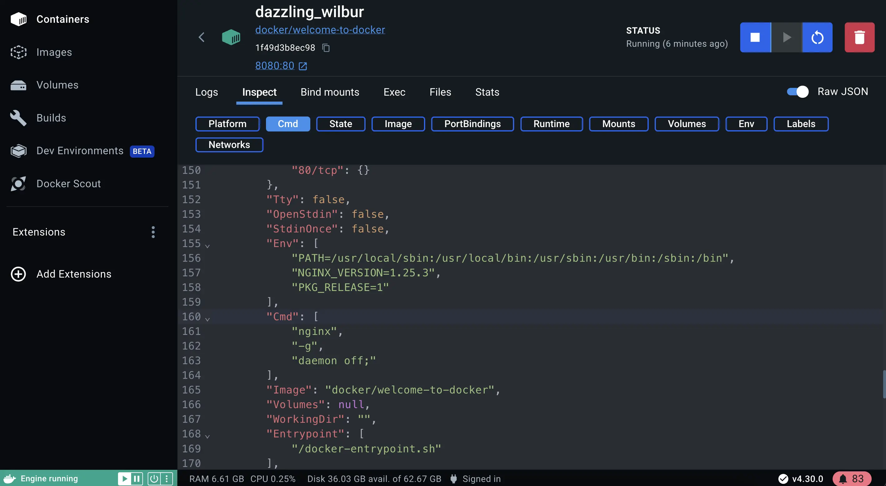

# Docker desktop

??? success "Explanation"

    Docker Desktop is the all-in-one package to build images, run containers, and so much more. This guide will walk you through the installation process, enabling you to experience Docker Desktop firsthand.

## Manage containers using Docker Desktop
1. Open Docker Desktop and select the **Containers** field on the left sidebar.
1. Select the Inspect field to obtain detailed information about the container. You can perform various actions such as pause, resume, start or stop containers, or explore the Logs, Bind mounts, Exec, Files, and Stats tabs.
 

1. Select the Inspect field to obtain detailed information about the c
ontainer. You can perform various actions such as pause, resume, start or stop containers, or explore the Logs, Bind mounts, Exec, Files, and Stats tabs. 
 

1. Open the client/src/components/AddNewItemForm.jsx file. This provides the component to add a new item to the to-do list.

1. Modify the placeholder attribute of the Form.Control element to whatever you'd like to display.

        type="text"
    

1. Save the file and go back to your browser. You should see the change already hot-reloaded into your browser. If you don't like it, feel free to tweak it until it looks just right.