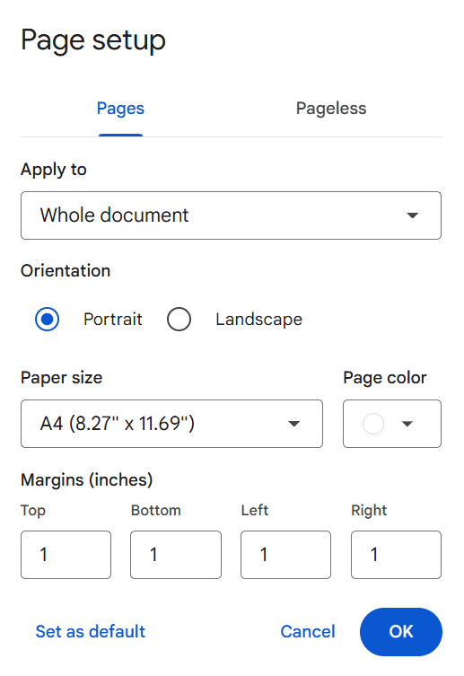

# Manage the page settings

Google Docs supports pages and pageless modes. To change the page settings in Google Docs:

=== "Pages"

    { align=right : style="height:476px;width:335px"}

    1. Open a document in Google Docs.
    1. Click **File** > **Page setup**.
    1. In the **Page setup** dialog, click **Pages**.
        - From the Apply to list, select where to apply the changes.
        - In Orientation, select Portrait or Landscape.
        - From the Paper size list, select required paper size.
        - From the Page color color picker, select the required page color.
        - In the Margins (inches) fields, enter required values for top, bottom, left, and right margin.
    1. Click OK.

=== "Pageless"

    1. Sed sagittis eleifend rutrum
    2. Donec vitae suscipit est
    3. Nulla tempor lobortis orci

New settings will be applied to the document. If required, click Set as default to apply these settings to any new created document.

{ align=right }

1. Open a document in Google Docs.
1. Click File > Page setup.
    - In the Page setup dialog, click Pages.
    - From the Apply to list, select where to apply the changes.
    - In Orientation, select Portrait or Landscape.
    - From the Paper size list, select required paper size.
    - From the Page color color picker, select the required page color.
    - In the Margins (inches) fields, enter required values for top, bottom, left, and right margin.
1. Click OK.