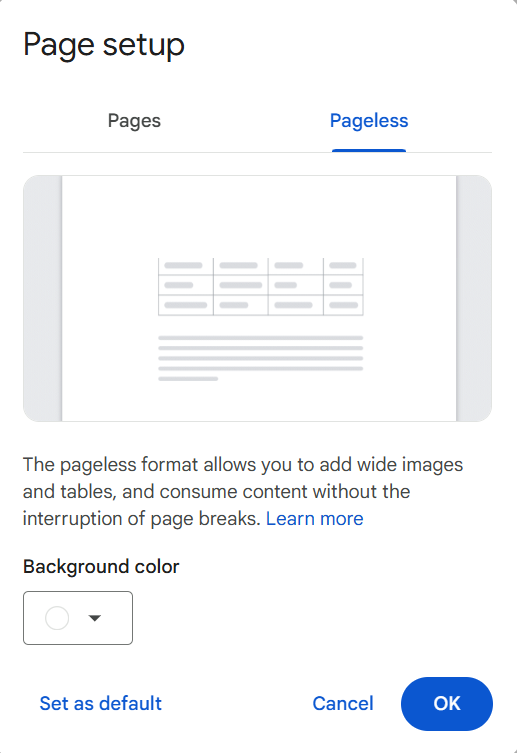

# Manage the page settings

Google Docs supports pages and pageless modes. To change the page settings in Google Docs, start with opening a document in Google Docs:

=== "Pages"

    { align=right : style="height:476px;width:335px"}

    1. Click **File** > **Page setup**.
    1. In the **Page setup** dialog, click **Pages**.
        - From the **Apply** to list, select where to apply the changes.
        - In **Orientation**, select **Portrait** or **Landscape**.
        - From the **Paper size** list, select required paper size.
        - From the **Page color** color picker, select the required page color.
        - In the **Margins (inches)** fields, enter required values for top, bottom, left, and right margin.
    1. Click **OK**.

=== "Pageless"

    { align=right : style="height:476px;width:335px"}

    1. Click **File** > **Page setup**.    
    1. In the **Page setup** dialog, click **Pageless**.
        - Optional: From the **Background color** color picker, select the required color.
    1. Click **OK**.

New settings will be applied to the document. 

!!! info

    If required, click **Set as default** to apply these settings to any new created document.

